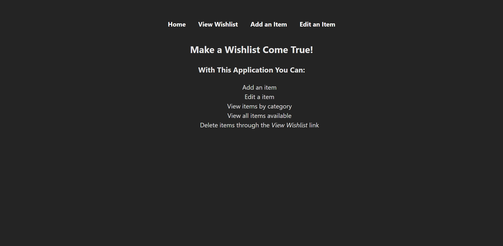
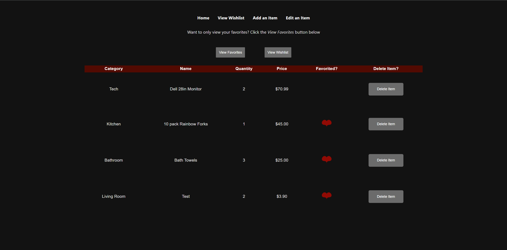
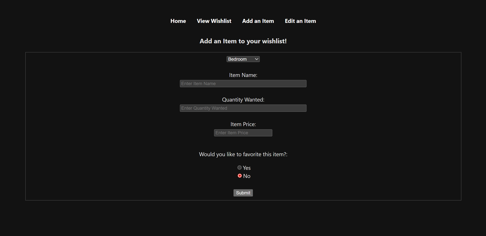
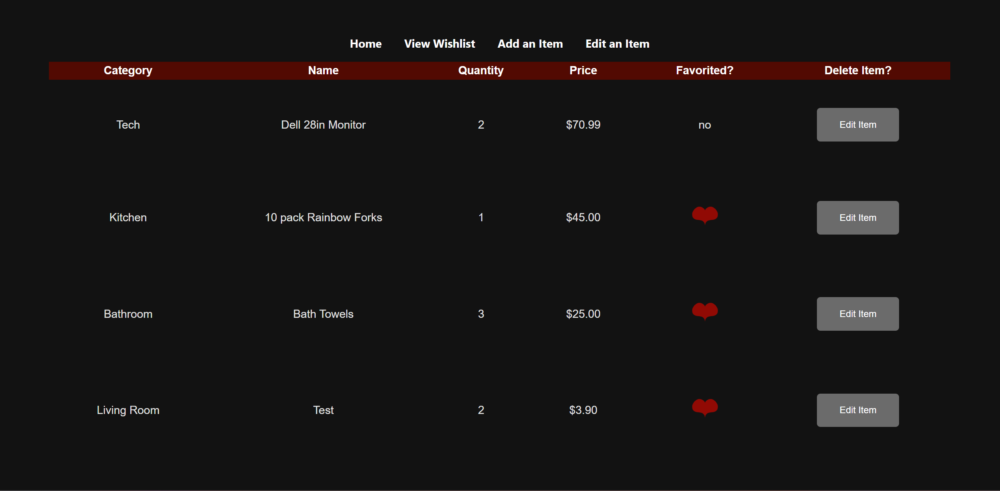

# CS 234W - Term Project
## Author: River
### Date: 03/18/2026

**Description:** CS 234W Term Project | This project uses API in the backend and react in the frontend. The Wishlist Application let's you view all items on your wishlist, delete an item, add an item, and edit an item. There is an option to filter the wishlist to only show items marked as a favorite or to show the whole wishlist.

> [!NOTE]
> API Usage/Requests:
> Home (via _Home_ Link):
    
> Wishlist (via _View Wishlist_ Link)
    
> Add Item (via _Add Item_ Link)
    
> Edit Item (via _Edit Item_ Link)
    
